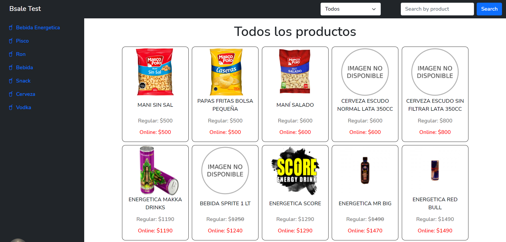
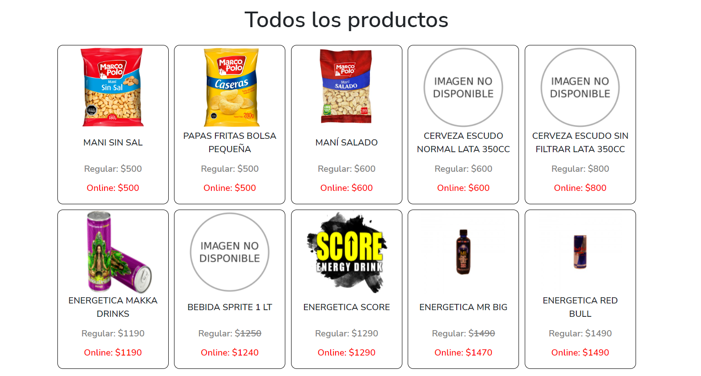
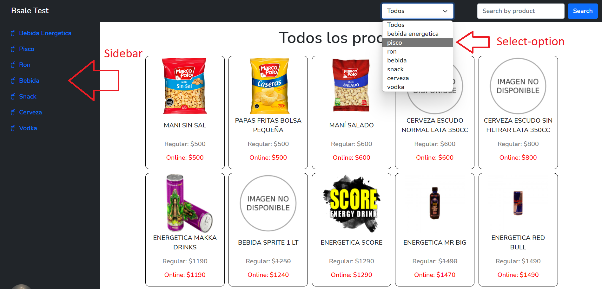
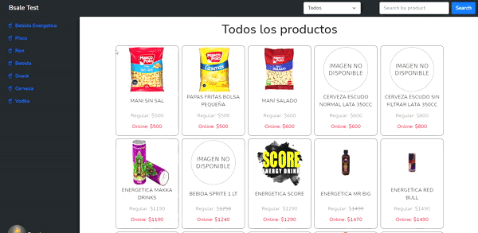
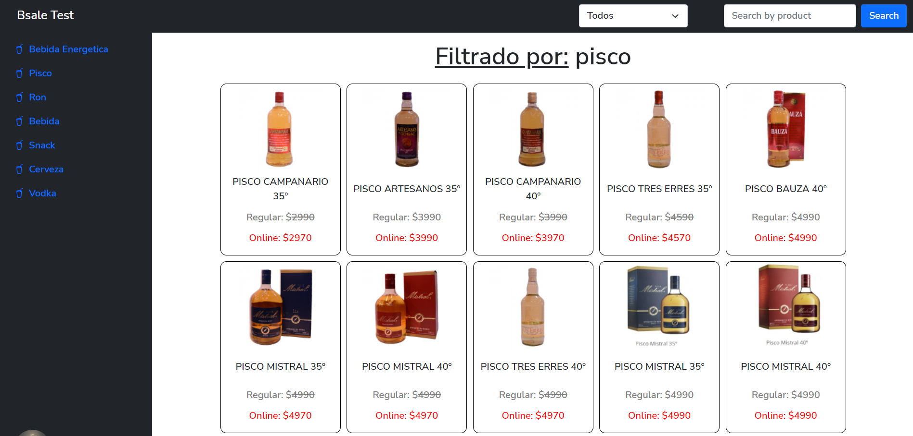
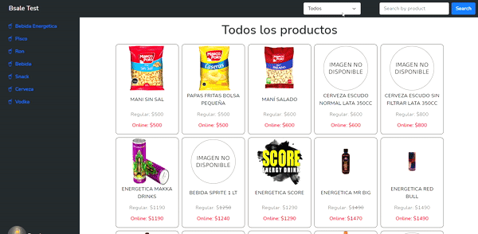
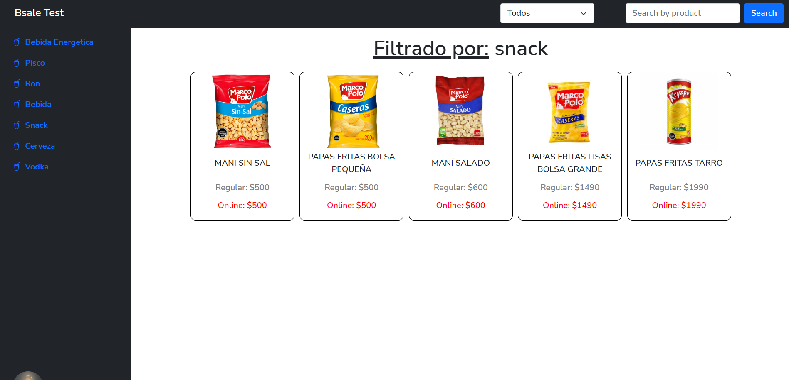
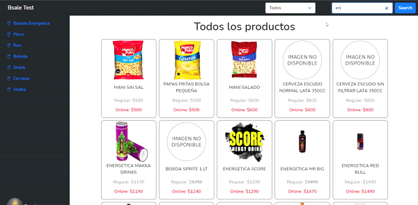
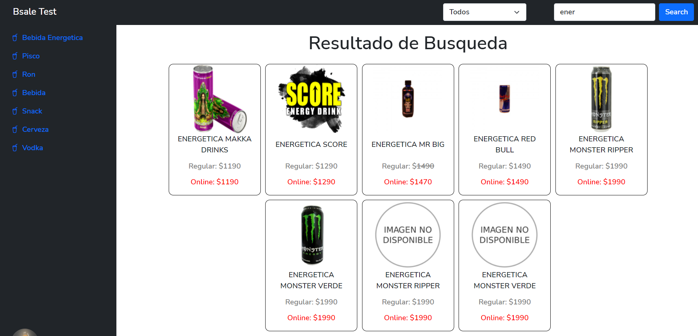
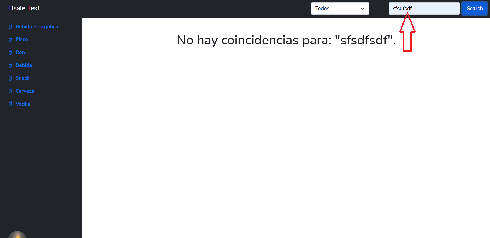

<h1 align="center">Bsale Test - Frontend</h1>
<p align="center"></p> 

### Tabla de contenidos:
---

- [Descripción y contexto](#descripción-y-contexto)
- [Guía de usuario](#guía-de-usuario)
- [Vista de escritorio](#vista-de-escritorio)
  - [Productos](#productos)
  - [Categorias](#categorias)
  - [SiderBar](#sidebar)
  - [Select-option](#select-option)
  - [Buscador](#buscador)
  - [Errores](#errores)
- [Guía de instalación](#guía-de-instalación)
- [Información adicional](#información-adicional)


### Descripción y contexto
---

🛍 🛒 **Bsale Test - Frontend** 🛍 🛒 es una tienda online de productos diversos. 🛒🛒🛒

Es una plataforma web, enfocada para los clientes; con la finalidad de brindarles una herramienta que facilite la busqueda de productos diversos a adquirir.

Constará con vista para celulares y para computadoras de escritorio.

Puede ser accedido a traves de: <a href="https://bs20-front.netlify.app/" target="_blank">https://bs20-front.netlify.app/</a>


### Guía de usuario
---

## Vista de Escritorio
<h1 align="center">Vista de Escritorio</h1>


Al iniciar la plataforma web de 🛍 🛒 **Bsale Test - Frontend** 🛍 🛒, desde el lado del cliente se realizarán `02 peticiones` a la `API del backend` para solicitar los datos de los `productos` y los datos de las `categorias`

`Nota:` Los `productos` estan alojados en la tabla "product" de la base de datos suministrados por la empresa

`Nota:` Las `categorias` estan alojadas en la tabla "category" de la base de datos suministrados por la empresa

`Nota:` La ruta del `API del backend` es: <a href="https://bs20-back.vercel.app/" target="_blank">https://bs20-back.vercel.app/</a>


## Productos
<h1>GET lista de "productos"</h1>

* **GET** /api/products retornara todos los **"productos"**
* Por medio de `AXIOS` se envia la solicitud GET a la API por medio de la URL: https://bs20-back.vercel.app/api/products
* En respuesta se obtiene todos los `productos`
* De momento, un total de 57 productos

```json
[
   {
      "id": 53,
      "name": "Mani Sin Sal",
      "url_image": "https://dojiw2m9tvv09.cloudfront.net/11132/product/manisinsalmp6988.jpg",
      "price": 500,
      "discount": 0,
      "category": 5
   },
   {
      "id": 55,
      "name": "Papas Fritas Bolsa Pequeña",
      "url_image": "https://dojiw2m9tvv09.cloudfront.net/11132/product/papaslisas7271.jpg",
      "price": 500,
      "discount": 0,
      "category": 5
   },
   ...
   {
      "id": 33,
      "name": "RON PAMPERO ANIVERSARIO",
      "url_image": "https://dojiw2m9tvv09.cloudfront.net/11132/product/ron_pampero_aniversario0311.jpg",
      "price": 20000,
      "discount": 15,
      "category": 3
   }
]
```

*  Finalmente, los `productos` son renderizados en el frontend


<p align="center"></p> 

`Nota:`
* Se identificó que el campo `url_image` de algunos productos se encontraban vacios `""` o con el valor `null`

```json
[
   ...
   {
      "id": 98,
      "name": "Cerveza Escudo Normal LATA 350CC",
      `"url_image": "",`
      "price": 600,
      "discount": 0,
      "category": 6
   },
   ...
   {
      "id": 68,
      "name": "Bebida Sprite 1 Lt",
      `"url_image": null,`
      "price": 1250,
      "discount": 10,
      "category": 4
   },
   ...
]
```

* En estos casos durante el renderizado en el Frontend, se agregó un condicional para estos casos
* Se asignó una imagen local llamada `Imagen no disponible`

<p align="center"></p> 

## Categorias
<h1>GET lista de "categorias"</h1>

* **GET** /api/categories retornara todas las `categorias`
* Por medio de `AXIOS` se envia la solicitud GET a la API por medio de la URL: https://bs20-back.vercel.app/api/categories
* En respuesta se obtiene todas las `categorias`
* De momento, un total de 7 categorias

```json
[
   {
      "id": 1,
      "name": "bebida energetica"
   },
   {
      "id": 2,
      "name": "pisco"
   },
   ...
   {
      "id": 7,
      "name": "vodka"
   }
]
```

*  Finalmente, las `categorias` son renderizadas en el `Sidebar` y en el `Select-option` del Navbar


`Nota:` Cada `producto` tiene un campo de `category` con un numero asignado entre 1 y 7.

`Nota:` Estos numeros estan relacionados con cada `categoria` obtenida.

`Nota:` Esto servirá para realizar el filtrado de los `productos` y ordenarlos por `categorias`

<p align="center"></p> 


## SideBar
<h1 align="center">📌Filtro de productos desde el "SideBar"</h1>
<p align="center"></p>

Ahora veamos acerca del filtrado de `productos` por medio de las `categorias` en el "Sidebar"

Al dar click sobre una de las `categorias` se enviará `01 peticion` a la `API del backend` para solicitar los datos de los `productos` filtrados por la `categoria` seleccionada

<h1>GET lista de "productos" filtrado por "categorias" desde el "Sidebar"</h1>

* **GET** /api/products/cat/:cat retornara los `productos` filtrados por la `categoria` seleccionada
* Por medio de `AXIOS` se envia la solicitud GET a la API por medio de la URL: `https://bs20-back.vercel.app/api/products/cat/:cat`
* En respuesta se obtiene los `productos` filtrados por `categoria`

`Nota:` En la URL `https://bs20-back.vercel.app/api/products/cat/:cat` el valor de `:cat` debe ser reemplazado por el `id` de la `categoria` seleccionada

`Nota:` Por ejemplo, si selecciono `pisco` su `id` es `2` Entonces la URL será https://bs20-back.vercel.app/api/products/cat/2

`Nota:` Se obtendran los `productos` que tengan el campo `category: 2`

```json
[
   {
      "id": 12,
      "name": "PISCO CAMPANARIO 35º",
      "url_image": "https://dojiw2m9tvv09.cloudfront.net/11132/product/campanario8845.jpg",
      "price": 2990,
      "discount": 20,
      `"category": 2`
   },
   {
      "id": 10,
      "name": "PISCO ARTESANOS 35º ",
      "url_image": "https://dojiw2m9tvv09.cloudfront.net/11132/product/artesanos8818.jpg",
      "price": 3990,
      "discount": 0,
      `"category": 2`
   },
   ...
   {
      "id": 91,
      "name": "PISCO MISTRAL NOBEL 40°",
      "url_image": "https://dojiw2m9tvv09.cloudfront.net/11132/product/nobel409551.jpg",
      "price": 19990,
      "discount": 0,
      `"category": 2`
   }
]
```

*  Finalmente, los `productos` filtrados por la `categoria` seleccionada, son renderizados en el frontend


<p align="center"></p>


## Select-option
<h1 align="center">📌Filtro de productos desde el "Select-option" del Navbar</h1>
<p align="center"></p>

Ahora veamos acerca del filtrado de `productos` por medio de las `categorias` en el `Select-option` del Navbar

Al dar click sobre una de las `categorias` se enviará `01 peticion` a la `API del backend` para solicitar los datos de los `productos` filtrados por la `categoria` seleccionada

<h1>GET lista de "productos" filtrado por "categorias" desde el "Select-option" del Navbar</h1>

* **GET** /api/products/cat/:cat retornara los `productos` filtrados por la `categoria` seleccionada
* Por medio de `AXIOS` se envia la solicitud GET a la API por medio de la URL: `https://bs20-back.vercel.app/api/products/cat/:cat`
* En respuesta se obtiene los `productos` filtrados por `categoria`

`Nota:` En la URL `https://bs20-back.vercel.app/api/products/cat/:cat` el valor de `:cat` debe ser reemplazado por el `id` de la `categoria` seleccionada

`Nota:` Por ejemplo, si selecciono `snack` su `id` es `5` Entonces la URL será https://bs20-back.vercel.app/api/products/cat/5

`Nota:` Se obtendran los `productos` que tengan el campo `category: 5`

```json
[
   {
      "id": 53,
      "name": "Mani Sin Sal",
      "url_image": "https://dojiw2m9tvv09.cloudfront.net/11132/product/manisinsalmp6988.jpg",
      "price": 500,
      "discount": 0,
      `"category": 5`
   },
   {
      "id": 55,
      "name": "Papas Fritas Bolsa Pequeña",
      "url_image": "https://dojiw2m9tvv09.cloudfront.net/11132/product/papaslisas7271.jpg",
      "price": 500,
      "discount": 0,
      `"category": 5`
   },
   ...
   {
      "id": 56,
      "name": "Papas Fritas Tarro",
      "url_image": "https://dojiw2m9tvv09.cloudfront.net/11132/product/78028005335657432.jpg",
      "price": 1990,
      "discount": 0,
      `"category": 5`
   }
]
```

*  Finalmente, los `productos` filtrados por la `categoria` seleccionada, son renderizados en el frontend


<p align="center"></p>


## Buscador
<h1 align="center">📌Filtro de productos desde el "Buscador" del Navbar</h1>
<p align="center"></p> 

Ahora veamos acerca del filtrado de `productos` por medio de los `nombres` de producto desde el "buscador" o "search bar" del Navbar

Al ingresar un `nombre` en el "buscador" o "search bar" del Navbar y dar click sobre el boton "search" o presionar "Enter", se enviará `01 peticion` a la `API del backend` para solicitar los datos de los `productos` filtrados por el `nombre` ingresado

<h1>GET lista de "productos" filtrado por "nombre" desde el "buscador" o "search bar" del Navbar</h1>

* **GET** /api/products/search/:text retornara los `productos` filtrados por `nombre` ingresado
* Por medio de `AXIOS` se envia la solicitud GET a la API por medio de la URL: `https://bs20-back.vercel.app/api/products/search/:text`
* En respuesta se obtiene los `productos` filtrados por `nombre`

`Nota:` En la URL `https://bs20-back.vercel.app/api/products/search/:text` el valor de `:text` debe ser reemplazado por el "nombre" ingresado en el "buscador" o "search bar" del Navbar

`Nota:` Por ejemplo, si selecciono `ener` entonces `:text` es reemplazado por `ener` Entonces la URL será https://bs20-back.vercel.app/api/products/search/ener

`Nota:` Se obtendran los `productos` que contengan la palabra `ener` en el campo `name` de cada producto

```json
[
   {
      "id": 35,
      `"name": "ENERGETICA MAKKA DRINKS",`
      "url_image": "https://dojiw2m9tvv09.cloudfront.net/11132/product/makka-drinks-250ml0455.jpg",
      "price": 1190,
      "discount": 0,
      "category": 1
   },
   {
      "id": 7,
      `"name": "ENERGETICA SCORE",`
      "url_image": "https://dojiw2m9tvv09.cloudfront.net/11132/product/logo7698.png",
      "price": 1290,
      "discount": 0,
      "category": 1
   },
   ...
   {
      "id": 79,
      `"name": "ENERGETICA MONSTER VERDE",`
      "url_image": "",
      "price": 1990,
      "discount": 0,
      "category": 1
   }
]
```

*  Finalmente, los `productos` filtrados por el nombre `ener` ingresado, son renderizados en el frontend


<p align="center"></p>


## Errores
<h1 align="center">📌Errores</h1>

`1er Error:` Se da cuando el nombre ingresado por medio del "buscador" o "search bar" del Navbar, no coincide con algun nombre de un producto de la Base de datos

`Solucion:` Intentar con ingresar otro nombre

<p align="center"></p>

`2do Error:` Se da cuando se interrumpe la conexion de internet o cuando no hay conexion con el servidor

`Solucion:` Recargar la pagina web o reiniciar la conexion a internet

	
### Guía de instalación
---
* El proyecto está basado en las tecnologias:
  * HTML, CSS, Javascript para el Frontend
  * Nodejs, Express para el Backend
  * Mysql para la Base de Datos
  * Boostrap 5 para los Estilos


* Para el Software de gestion de paquetes del Backend se está usando NPM
* Para la instalacion:
  * Clonar el repositorio


### Información adicional
---
### 🔭Skils:
Tecnologias utilizadas

| `🔭Frontend` | `⚡Backend` | `📫Database` |
| ------ | ------ | ------ | 
| CSS | Node js | Mysql |
| Bootstrap | Express |  |
| Javascript |  |  |


### 💻Pagina web: 📱
<ul>
<li> Frontend: <a href="https://bs20-front.netlify.app/" target="_blank">https://bs20-front.netlify.app/</a> </li>
<li> Backend: <a href="https://bs20-back.vercel.app/" target="_blank">https://bs20-back.vercel.app/</a> </li>
</ul>
